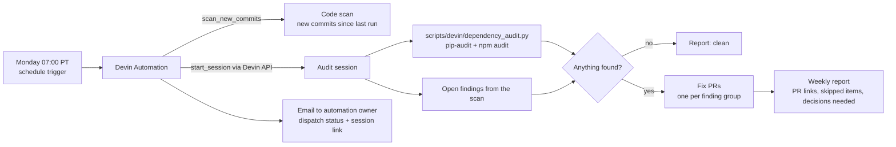

<!--
Licensed to the Apache Software Foundation (ASF) under one
or more contributor license agreements.  See the NOTICE file
distributed with this work for additional information
regarding copyright ownership.  The ASF licenses this file
to you under the Apache License, Version 2.0 (the
"License"); you may not use this file except in compliance
with the License.  You may obtain a copy of the License at

  http://www.apache.org/licenses/LICENSE-2.0

Unless required by applicable law or agreed to in writing,
software distributed under the License is distributed on an
"AS IS" BASIS, WITHOUT WARRANTIES OR CONDITIONS OF ANY
KIND, either express or implied.  See the License for the
specific language governing permissions and limitations
under the License.
-->

# Devin Setup and Security Automation

This fork uses [Devin](https://docs.devin.ai) as an automated contributor for security
and dependency maintenance. This page covers what lives in the repository, what has to
be configured once in GitHub and Devin, and how the weekly remediation loop works.

## What is in the repository

| Path | Purpose |
| --- | --- |
| `AGENTS.md`, `SECURITY.md` | Conventions and the threat model every Devin session reads first. Findings are only in scope if they violate the role/capability matrix in `SECURITY.md`. |
| `.agents/skills/superset-native-dev/SKILL.md` | How to run Superset, its unit tests and pre-commit without Docker (the path Devin's VM uses). |
| `.agents/skills/security-remediation/SKILL.md` | The fix -> regression test -> pre-commit -> PR loop and reporting format for scan findings and vulnerable dependencies. |
| `scripts/devin/dependency_audit.py` | Runs `pip-audit` on `requirements/*.txt` and `npm audit` on `superset-frontend`, writes `<out>.json` + `<out>.md`, exits 1 when anything is vulnerable. |
| `docs/developer_docs/contributing/devin-automation.md` | This page. |

Skills under `.agents/skills/` are picked up automatically by Devin sessions working in
this repository. Keep them factual: only commands that have actually been run.

## One-time setup

### 1. GitHub integration

Install the Devin GitHub App from **app.devin.ai -> Settings -> Integrations -> GitHub**
and grant it this repository. Devin needs read/write on `contents`, `pull requests`,
`issues`, `checks` and `commit statuses` so it can push branches, open PRs and report CI
status. The full permission list is in the
[Devin GitHub integration docs](https://docs.devin.ai/integrations/gh).

### 2. Repository settings

- **Enable Issues** (Settings -> General -> Features). Devin's integration cannot turn
  this on itself; with issues disabled, issue-based triggers and scan-finding issues
  fail with `403 Resource not accessible by integration`.
- Create the label `devin-fix`. Adding it to an issue, or commenting `/devin-fix` on an
  issue or PR, dispatches a remediation session.
- Protect `master`. Devin only opens PRs against it and never pushes to it directly.

### 3. Environment blueprint

Devin sessions boot from a snapshot built from the repository's environment blueprint
(Devin -> repository settings -> Environment). It should reproduce the native setup in
`.agents/skills/superset-native-dev/SKILL.md`: Python 3.11 venv from
`requirements/development.txt`, `pip-audit`, Node 24 with npm 11, `npm ci` in
`superset-frontend`, `pre-commit install`. No secrets are needed for the weekly job.

### 4. Network policy

Automation-spawned sessions run behind an allowlist. Besides the Git Manager host the
automation schema requires, the weekly job needs `pypi.org`, `files.pythonhosted.org`
(pip-audit's OSV lookups go through PyPI's advisory API) and `registry.npmjs.org`
(`npm audit`).

## Weekly security + dependency loop

A Devin Automation named **Superset weekly security + dependency audit** runs every
Monday at 07:00 America/Los_Angeles (RRULE `FREQ=WEEKLY;BYDAY=MO;BYHOUR=7`). Security
findings and dependency drift are handled together because a stale dependency is
usually how a known CVE gets into the deployment.



What each step does:

1. **Code scan refresh** (`scan_new_commits`): re-runs the existing Devin security scan
   against commits landed since the previous run. Findings accumulate on the same scan,
   so previously dismissed items stay dismissed.
2. **Audit session** (`start_session`): the automation calls the Devin sessions API to
   start a session with the repository checked out. That session runs
   `scripts/devin/dependency_audit.py`, reads the scan's open findings, and decides per
   item whether to fix, skip (out of scope per `SECURITY.md`, already fixed, false
   positive) or escalate.
3. **Remediation**: for each actionable item the session follows
   `.agents/skills/security-remediation/SKILL.md` and opens a PR on a
   `devin/<timestamp>-<slug>` branch with a regression test and the verification output.
4. **Observable outputs**: the PRs themselves, a Markdown weekly report attached to the
   session (and posted as an issue when issues are enabled), and the automation's built-in
   email notification to its owner with the dispatch result and session link.

### Running it by hand

```bash
# Dependency half of the job, locally
uv pip install pip-audit
python scripts/devin/dependency_audit.py --out /tmp/dependency-audit
cat /tmp/dependency-audit.md
```

The automation can also be fired outside its schedule from the Devin web app
(Automations -> Run now) or through the Devin API; see the
[API overview](https://docs.devin.ai/api-reference/overview). Sessions started by the
API use the same prompt and produce the same outputs.

### Triage rules for the remediation session

- A code finding is actionable only if a non-Admin principal can do something the
  matrix in `SECURITY.md` does not allow. Admin-only or operator-configuration issues are
  reported, not fixed.
- A dependency finding is actionable when the advisory applies to the pinned version and
  a fixed release exists. The PR must say whether Superset reaches the vulnerable code
  path; if no fix exists, the report lists it under "needs human decision".
- Never weaken tests, never push to `master`, one PR per finding group, draft PR when
  verification could not run.
