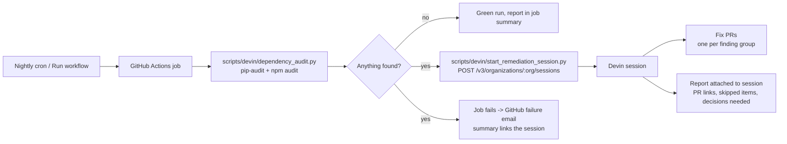

<!--
Licensed to the Apache Software Foundation (ASF) under one
or more contributor license agreements.  See the NOTICE file
distributed with this work for additional information
regarding copyright ownership.  The ASF licenses this file
to you under the Apache License, Version 2.0 (the
"License"); you may not use this file except in compliance
with the License.  You may obtain a copy of the License at

  http://www.apache.org/licenses/LICENSE-2.0

Unless required by applicable law or agreed to in writing,
software distributed under the License is distributed on an
"AS IS" BASIS, WITHOUT WARRANTIES OR CONDITIONS OF ANY
KIND, either express or implied.  See the License for the
specific language governing permissions and limitations
under the License.
-->

# Devin Setup and Security Automation

This fork uses [Devin](https://docs.devin.ai) as an automated contributor for security
and dependency maintenance. This page covers what lives in the repository, what has to
be configured once in GitHub and Devin, and how the nightly remediation loop works.

## What is in the repository

| Path | Purpose |
| --- | --- |
| `AGENTS.md`, `SECURITY.md` | Conventions and the threat model every Devin session reads first. Findings are only in scope if they violate the role/capability matrix in `SECURITY.md`. |
| `.agents/skills/superset-native-dev/SKILL.md` | How to run Superset, its unit tests and pre-commit without Docker (the path Devin's VM uses). |
| `.agents/skills/security-remediation/SKILL.md` | The fix -> regression test -> pre-commit -> PR loop and reporting format for scan findings and vulnerable dependencies. |
| `scripts/devin/dependency_audit.py` | Runs `pip-audit` on `requirements/*.txt` and `npm audit` on `superset-frontend`, writes `<out>.json` + `<out>.md`, exits 1 when anything is vulnerable. |
| `scripts/devin/start_remediation_session.py` | Turns the audit JSON into a prompt and starts a Devin session through the v3 sessions API. |
| `.github/workflows/devin-nightly-security-audit.yml` | Nightly cron (and manual) workflow that runs the audit and, on findings, starts the session. |
| `docs/developer_docs/contributing/devin-automation.md` | This page. |

Skills under `.agents/skills/` are picked up automatically by Devin sessions working in
this repository. Keep them factual: only commands that have actually been run.

## One-time setup

### 1. GitHub integration

Install the Devin GitHub App from **app.devin.ai -> Settings -> Integrations -> GitHub**
and grant it this repository. Devin needs read/write on `contents`, `pull requests`,
`issues`, `checks` and `commit statuses` so it can push branches, open PRs and report CI
status. The full permission list is in the
[Devin GitHub integration docs](https://docs.devin.ai/integrations/gh).

### 2. Repository settings

- **Enable Issues** (Settings -> General -> Features). Devin's integration cannot turn
  this on itself; with issues disabled, issue-based triggers and scan-finding issues
  fail with `403 Resource not accessible by integration`.
- Add the `DEVIN_API_KEY` and `DEVIN_ORG_ID` Actions secrets (see below).
- Protect `master`. Devin only opens PRs against it and never pushes to it directly.

### 3. Environment blueprint

Devin sessions boot from a snapshot built from the repository's environment blueprint
(Devin -> repository settings -> Environment). It should reproduce the native setup in
`.agents/skills/superset-native-dev/SKILL.md`: Python 3.11 venv from
`requirements/development.txt`, `pip-audit`, Node 24 with npm 11, `npm ci` in
`superset-frontend`, `pre-commit install`. The remediation session needs no secrets.

### 4. Network access

If the organization restricts session egress, the remediation session needs `pypi.org`,
`files.pythonhosted.org` (pip-audit's advisory lookups) and `registry.npmjs.org`
(`npm audit`, lockfile regeneration) in addition to GitHub.

## Nightly security + dependency loop

The GitHub Actions workflow `.github/workflows/devin-nightly-security-audit.yml` runs
every night at 07:00 UTC (midnight Pacific) and can be started by hand from the Actions
tab (**Run workflow**). Security findings and dependency drift are handled together
because a stale dependency is usually how a known CVE gets into the deployment.



What each step does:

1. **Audit** (`dependency_audit.py`): `pip-audit` on `requirements/*.txt` and
   `npm audit` on the frontend lockfile. The Markdown report goes into the job summary
   and is uploaded as the `dependency-audit` artifact.
2. **Session start** (`start_remediation_session.py`): when findings exist the job calls
   the [Devin v3 sessions API](https://docs.devin.ai/api-reference/v3/sessions/post-organizations-sessions)
   with a prompt that embeds the findings table and points at
   `.agents/skills/security-remediation/SKILL.md`. The response's session URL is written
   to the job summary.
3. **Remediation**: the session confirms each pin on the default branch, groups findings
   by package, and opens one PR per group on a `devin/<timestamp>-<slug>` branch with
   regenerated lockfiles and the verification output. It also lists the open findings of
   the standing Devin security scan, leaving the dataset-export `encrypted_extra`
   finding untouched.
4. **Observable outputs**: the PRs, the report attached to the session, the workflow
   job summary, and the failed workflow run itself (GitHub emails the repo's
   notification recipients on scheduled-workflow failures).

### Secrets

| Secret | Where to get it |
|---|---|
| `DEVIN_API_KEY` | Devin -> Settings -> Service users: create a service user with `ManageOrgSessions` and copy its key. |
| `DEVIN_ORG_ID` | Devin -> Settings (the `org-...` identifier). |

Add both under repository Settings -> Secrets and variables -> Actions. Without them
the audit still runs and reports; only the session start step fails.

### Running it by hand

```bash
# Dependency half of the job, locally
uv pip install pip-audit
python scripts/devin/dependency_audit.py --out /tmp/dependency-audit
cat /tmp/dependency-audit.md
```

```bash
# Preview the exact session request without calling the API
python scripts/devin/start_remediation_session.py \
  --report /tmp/dependency-audit.json --repo gracefujinaga/superset --dry-run

# Start the session for real
DEVIN_API_KEY=... DEVIN_ORG_ID=org-... \
  python scripts/devin/start_remediation_session.py \
  --report /tmp/dependency-audit.json --repo gracefujinaga/superset
```

### Triage rules for the remediation session

- A code finding is actionable only if a non-Admin principal can do something the
  matrix in `SECURITY.md` does not allow. Admin-only or operator-configuration issues are
  reported, not fixed.
- A dependency finding is actionable when the advisory applies to the pinned version and
  a fixed release exists. The PR must say whether Superset reaches the vulnerable code
  path; if no fix exists, the report lists it under "needs human decision".
- Never weaken tests, never push to `master`, one PR per finding group, draft PR when
  verification could not run.
